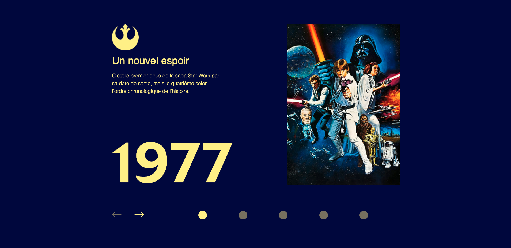

# StarWars-Integration

Integration work based on Figma template.
Responsive is not created for yet.

## Technologies used

 

## Result

You can try it here : [link to the website](https://quentinroggy.github.io/StarWars-Integration/)

## Template

Figma template provided by [@Benjamin_Code](https://www.youtube.com/c/BenjaminCode)

[Link to Figma Template](https://www.youtube.com/redirect?event=video_description&redir_token=QUFFLUhqbHhhaUdQSmtrTFpySVZxeFZMMTNKUWFVUllEQXxBQ3Jtc0tsb1JFU3BUQjNycURhbVl2dlUtZVJ5SS12RHZGZHRXcDlpX214MlhzVmtPazk3XzJsdTRKdEI1ZkxtWGFDOG1oQklBUUdqVkpsNjJwWnNqUWZ3bmxxb3BHaU9iNC1UaEp3bkZoMkRFMzVSbTY3VWppcw&q=https%3A%2F%2Fwww.figma.com%2Fproto%2FxaisLkNZJvZXq6Ca8qO6El%2FUI_StarWars%3Fnode-id%3D172%253A291%26scaling%3Dmin-zoom%26page-id%3D0%253A1%26starting-point-node-id%3D172%253A243&v=Ld97MuYMaQQ)

